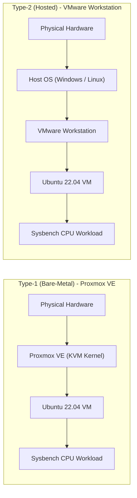
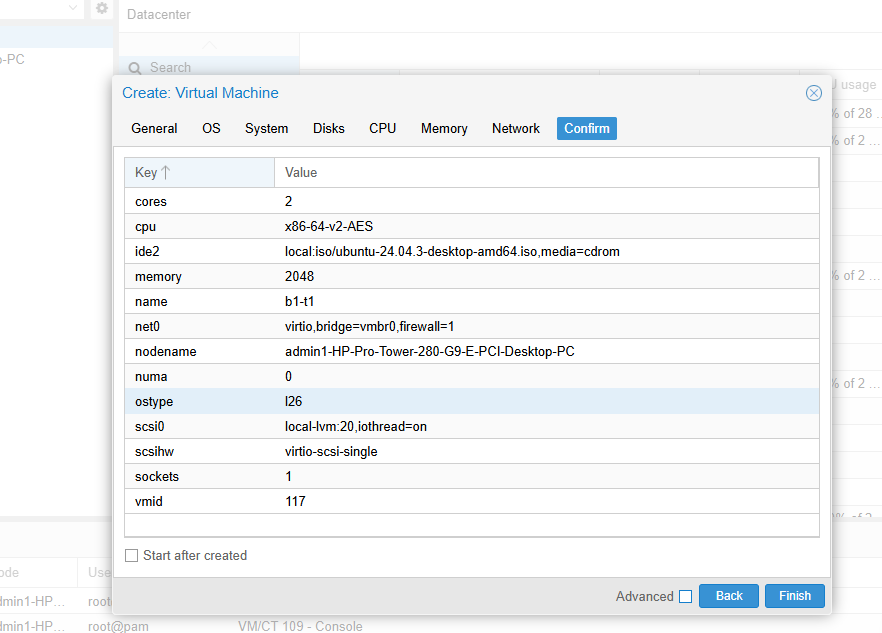
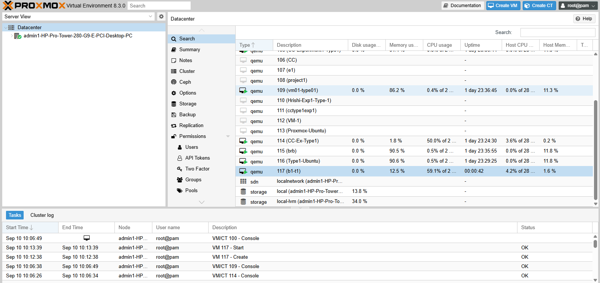
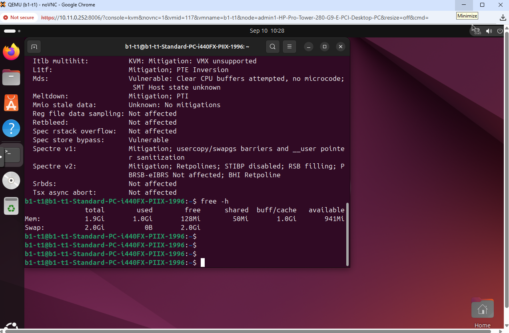
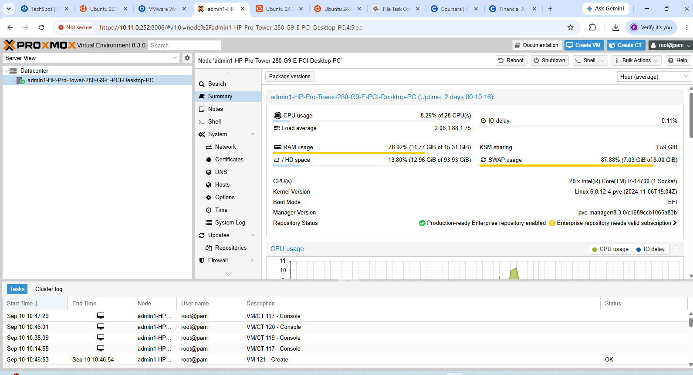

# Experiment 01: Hypervisor Performance Analysis
## Benchmarking Type-1 (Proxmox VE) vs Type-2 (VMware Workstation) Virtualization

[](https://github.com)
[](https://www.proxmox.com)
[](https://www.vmware.com)
[](https://ubuntu.com)
[](https://github.com/akopytov/sysbench)

---

## Table of Contents
- [1. Overview and Architecture](#1-overview-and-architecture)
- [2. Standard Virtual Machine Allocation](#2-standard-virtual-machine-allocation)
- [3. Repository Structure](#3-repository-structure)
- [4. Hands-on Step-by-Step Guide](#4-hands-on-step-by-step-guide)
  - [Part A: Type-1 Hypervisor (Proxmox VE — Bare-Metal)](#part-a-type-1-hypervisor-proxmox-ve--bare-metal)
  - [Part B: Type-2 Hypervisor (VMware Workstation — Hosted)](#part-b-type-2-hypervisor-vmware-workstation--hosted)
- [5. Performance Benchmark Results](#5-performance-benchmark-results)
- [6. Comparative Performance Analysis](#6-comparative-performance-analysis)
- [7. Command Reference Cheat Sheet](#7-command-reference-cheat-sheet)
- [8. Author Information](#8-author-information)

---

## 1. Overview and Architecture

### Objective
To deploy identically provisioned Ubuntu virtual machines on a **Type-1 Bare-Metal Hypervisor (Proxmox VE)** and a **Type-2 Hosted Hypervisor (VMware Workstation)**, measure their compute throughput and latency distribution using **Sysbench**, and evaluate virtualization overhead.



---

## 2. Standard Virtual Machine Allocation

To ensure fair and scientifically valid comparison, both virtual machines were configured with identical resource limits:

| Parameter | Allocated Value | Description |
| :--- | :--- | :--- |
| **Guest OS** | Ubuntu 22.04 / 24.04 LTS (64-bit) | Standard Linux baseline |
| **vCPU Allocation** | 2 Cores | 1 Socket × 2 Cores |
| **Memory Allocation (RAM)** | 2048 MB (2.0 GB) | Fixed memory boundary |
| **Virtual Storage** | 20.0 GB | Fixed virtual disk capacity |
| **Network Interface** | Bridged (`vmbr0`) / NAT | Internet access for package downloads |
| **Benchmark Command** | `sysbench cpu --cpu-max-prime=20000 run` | CPU stress test calculating primes up to 20,000 |

---

## 3. Repository Structure

```text
CC-Experiment-01-Hypervisor-Analysis/
├── screenshots/
│   ├── type1-proxmox/
│   │   ├── 01-proxmox-dashboard.png
│   │   ├── 02-proxmox-vm-configuration.png
│   │   ├── 03-proxmox-vm-running.png
│   │   ├── 04-proxmox-ubuntu-console.png
│   │   ├── 05-proxmox-system-configuration.png
│   │   ├── 06-proxmox-sysbench-result.png
│   │   └── 07-proxmox-resource-monitoring.png
│   │
│   ├── type2-vmware/
│   │   ├── 01-vmware-vm-configuration.png
│   │   ├── 02-vmware-vm-running.png
│   │   ├── 03-vmware-system-configuration.png
│   │   └── 04-vmware-sysbench-result.png
│   │
│   └── comparison/
│       └── 01-hypervisor-performance-comparison.png
│
├── results/
│   └── performance-analysis.md
│
└── README.md
```

---

## 4. Hands-on Step-by-Step Guide

---

### Part A: Type-1 Hypervisor (Proxmox VE — Bare-Metal)

#### Step 1: Access Proxmox VE Web Management Interface
1. Open your web browser and navigate to `https://<PROXMOX_SERVER_IP>:8006`.
2. Accept the self-signed SSL security notice and log in with assigned administrative credentials.

<div align="center">
  
  <p><strong>Figure 1.1:</strong> Proxmox VE Web Management Dashboard showing Datacenter topology and Node status.</p>
</div>

---

#### Step 2: Virtual Machine Provisioning
1. Click **Create VM** in the top-right toolbar.
2. Configure parameters:
   - **General**: Node = `pve`, VM ID = `117`, Name = `b1-t1`
   - **OS**: Storage = `local`, ISO Image = `ubuntu-24.04-desktop-amd64.iso`
   - **Disks**: Storage = `local-lvm`, Disk Size = `20 GB`, Bus = `SCSI (VirtIO)`
   - **CPU**: Sockets = `1`, Cores = `2` (Total: 2 vCPUs)
   - **Memory**: `2048 MiB` (2 GB RAM)
   - **Network**: Bridge = `vmbr0`, Model = `VirtIO (paravirtualized)`
3. Review the summary and click **Finish**.

<div align="center">
  
  <p><strong>Figure 1.2:</strong> Proxmox VM hardware allocation summary showing 2 Cores, 2048 MB RAM, and 20 GB SCSI Disk.</p>
</div>

---

#### Step 3: Power On and Monitor VM State
1. Select the created virtual machine from the left navigation panel.
2. Click **Start** and monitor the live VM uptime and resource usage from the Node dashboard.

<div align="center">
  
  <p><strong>Figure 1.3:</strong> Proxmox node overview showing VM 117 running with active CPU and memory allocation.</p>
</div>

---

#### Step 4: Open Console and Verify System Identity
Open the noVNC interactive console and verify the operating system environment:

```bash
# Verify system hostname, kernel release, and hardware architecture
hostnamectl
```

<div align="center">
  
  <p><strong>Figure 1.4:</strong> noVNC terminal console displaying hostnamectl output confirming KVM virtualization on x86-64.</p>
</div>

---

#### Step 5: Verify Hardware Resource Allocation
Run the diagnostic commands inside the Ubuntu VM terminal:

```bash
# Verify processor topology and virtualization flags
lscpu

# Verify total memory allocated (Expect ~1.9 to 2.0 GiB)
free -h

# Verify virtual hard disk partitions (Expect 20 GB root disk)
df -h
```

<div align="center">
  
  <p><strong>Figure 1.5:</strong> Verification output showing 2 vCPUs and 1.9 GiB allocated memory.</p>
</div>

---

#### Step 6: Install Sysbench and Execute CPU Benchmark
Install Sysbench and trigger the prime number computation benchmark:

```bash
# 1. Update APT repository index and install Sysbench
sudo apt update && sudo apt install sysbench -y

# 2. Run CPU stress test calculating primes up to 20,000
sysbench cpu --cpu-max-prime=20000 run
```

<div align="center">
  
  <p><strong>Figure 1.6:</strong> Sysbench CPU benchmark on Proxmox VE recording 1,749.16 Events Per Second and 0.57 ms average latency.</p>
</div>

---

#### Step 7: Node Resource Monitoring and Safe Teardown
Monitor node-level hardware metrics from the Proxmox summary dashboard before shutting down:

```bash
sudo poweroff
```

<div align="center">
  
  <p><strong>Figure 1.7:</strong> Proxmox VE node-level resource utilization graph showing CPU load and RAM usage.</p>
</div>

---

### Part B: Type-2 Hypervisor (VMware Workstation — Hosted)

#### Step 1: Virtual Machine Creation and Hardware Customization
1. Open **VMware Workstation** and click **Create a New Virtual Machine**.
2. Select **Typical (recommended)** and select `ubuntu-22.04.iso`.
3. Set VM Name to `CC-Experiment1-Type2` and Disk Size to **20.0 GB**.
4. Click **Customize Hardware**:
   - **Memory**: `2048 MB` (2 GB RAM)
   - **Processors**: `1 Processor`, `2 Cores per processor` (Total: 2 vCPUs)
   - **Network**: `NAT`

<div align="center">
  
  <p><strong>Figure 2.1:</strong> VMware Workstation hardware configuration dialogue with 2 GB RAM, 2 vCPUs, and 20 GB disk.</p>
</div>

---

#### Step 2: Boot VM and Install Ubuntu Operating System
1. Power on the virtual machine and complete standard Ubuntu installation.
2. Restart and log in to the desktop.

<div align="center">
  
  <p><strong>Figure 2.2:</strong> Ubuntu 22.04 LTS operating system running inside VMware Workstation.</p>
</div>

---

#### Step 3: Verify System Resources in Terminal
Open the terminal in Ubuntu and run:

```bash
# Verify system hostname and Linux kernel
hostnamectl

# Inspect CPU topology and vCPU count
lscpu

# Inspect RAM capacity and usage
free -h

# Check filesystem disk utilization
df -h
```

<div align="center">
  
  <p><strong>Figure 2.3:</strong> Terminal diagnostic output verifying 2 vCPUs, 2.0 GiB RAM, and 20 GB root disk filesystem on VMware VM.</p>
</div>

---

#### Step 4: Execute Sysbench CPU Benchmark
Install Sysbench and execute the CPU test:

```bash
# Update repositories and install Sysbench
sudo apt update && sudo apt install sysbench -y

# Execute CPU benchmark with prime-number limit of 20,000
sysbench cpu --cpu-max-prime=20000 run
```

<div align="center">
  
  <p><strong>Figure 2.4:</strong> Sysbench CPU benchmark execution result on VMware Workstation recording 621.07 Events Per Second and 1.61 ms average latency.</p>
</div>

---

#### Step 5: Safe Teardown
```bash
sudo poweroff
```

---

## 5. Performance Benchmark Results

### Quantitative Benchmark Comparison Table

| Performance Metric | Type-1: Proxmox VE (Bare-Metal) | Type-2: VMware Workstation (Hosted) | Comparison / Advantage |
| :--- | :--- | :--- | :--- |
| **Virtualization Model** | **Bare-Metal (Type-1)** | **Hosted (Type-2)** | Direct HW vs Host OS Abstraction |
| **Host OS Layer** | *None (Direct KVM Kernel)* | Windows 11 Host OS | Eliminates Host OS Scheduling Jitter |
| **Allocated vCPU** | 2 vCPUs | 2 vCPUs | Identical |
| **Allocated Memory** | 2048 MB (2.0 GB) | 2048 MB (2.0 GB) | Identical |
| **Allocated Storage** | 20.0 GB | 20.0 GB | Identical |
| **Workload Parameter** | `cpu-max-prime=20000` | `cpu-max-prime=20000` | Identical |
| **Total Execution Time** | **10.0005 s** | **10.0011 s** | Equivalent test duration |
| **Total Events Processed**| **17,494 events** | **6,213 events** | **+181.6% More Work Done** |
| **Events Per Second (EPS)**| **1,749.16 EPS** | **621.07 EPS** | **+2.82x Higher Throughput (Proxmox)** |
| **Average Latency** | **0.57 ms** | **1.61 ms** | **64.6% Lower Latency (Proxmox)** |
| **95th Percentile Latency**| **0.58 ms** | **1.93 ms** | **69.9% Lower Tail Latency** |
| **Minimum Latency** | **0.57 ms** | **1.51 ms** | **62.3% Lower Latency Floor** |
| **Maximum Latency** | **2.43 ms** | **4.57 ms** | **46.8% Lower Latency Spikes** |

---

## 6. Comparative Performance Analysis

<div align="center">
  
  <p><strong>Figure 3.1:</strong> Quantitative comparison chart illustrating CPU throughput (EPS), total events processed, and latency distribution between Type-1 and Type-2 hypervisors.</p>
</div>

### In-Depth Architectural Evaluation

1. **Throughput Disparity (1,749.16 EPS vs 621.07 EPS)**:
   - **Proxmox VE (Type-1)** achieved **2.82x higher computational throughput** compared to VMware Workstation.
   - In Type-1 hypervisors, guest vCPU threads run directly on physical hardware threads via the Linux KVM hypervisor kernel. The hardware-assisted virtualization extensions (`Intel VT-x` / `AMD-V`) execute unprivileged guest CPU instructions natively without interception.
   - In Type-2 hypervisors, guest CPU operations are abstracted by VMware's VMM (Virtual Machine Monitor) running inside the host OS user/kernel space, competing against host system threads and antivirus scans for CPU cycles.

2. **Latency and Jitter Reduction (0.57 ms vs 1.61 ms)**:
   - Proxmox demonstrated **64.6% lower average latency** and a tightly bound 95th percentile latency of **0.58 ms** compared to **1.93 ms** on VMware.
   - The extra context-switching boundaries in hosted hypervisors (Guest OS → Hypervisor App → Host OS Kernel → Physical CPU) introduce latency variability (jitter). Type-1 hypervisors bypass this intermediate layer entirely.

3. **Memory Translation Efficiency**:
   - Type-1 virtualization utilizes Second Level Address Translation (SLAT / Extended Page Tables - EPT) directly in hardware, enabling single-stage translation from guest physical to host physical memory.
   - Type-2 virtualization requires dual address translation coordination with the host OS virtual memory manager, incurring higher Translation Lookaside Buffer (TLB) miss penalties under compute bursts.

---

## 7. Command Reference Cheat Sheet

| Command | Purpose | What to Look For |
| :--- | :--- | :--- |
| `hostnamectl` | Check OS and Kernel details | Confirms Ubuntu release, kernel, and virtualization type |
| `lscpu` | Verify CPU configuration | `CPU(s): 2` matches allocated vCPUs |
| `free -h` | Verify memory allocation | `Mem: Total` shows ~1.9 to 2.0 GiB |
| `df -h` | Verify disk partitions | Root partition shows ~20 GB disk capacity |
| `sudo apt update && sudo apt install sysbench -y` | Install benchmarking tool | Successful package installation |
| `sysbench cpu --cpu-max-prime=20000 run` | Run CPU stress benchmark | Outputs `events per second` and latency distribution |
| `sudo poweroff` | Gracefully shut down the VM | Safely powers off the guest operating system |

---

## 8. Author Information

- **Student Name**: Aditya Gavimath
- **Topic**: Cloud Computing
- **Experiment Title**: Experiment 01 — Performance Analysis of Type-1 and Type-2 Hypervisors
