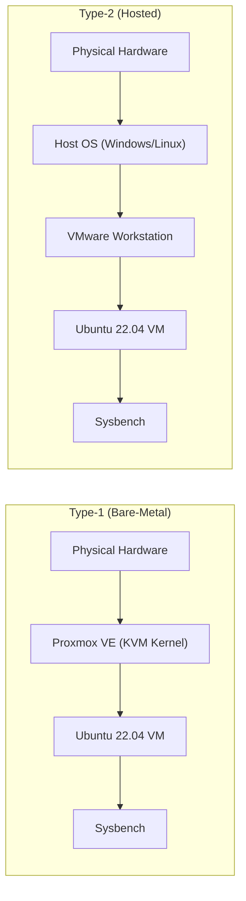

# Experiment 01: Hypervisor Performance Analysis
## Benchmarking Type-1 (Proxmox VE) vs Type-2 (VMware Workstation) Virtualization

[](https://github.com)
[](https://www.proxmox.com)
[](https://www.vmware.com)
[](https://ubuntu.com)
[](https://github.com/akopytov/sysbench)

---

## 1. Overview and Architecture

### Objective
To deploy identically provisioned Ubuntu 22.04 LTS virtual machines on a **Type-1 Bare-Metal Hypervisor (Proxmox VE)** and a **Type-2 Hosted Hypervisor (VMware Workstation)**, measure their CPU compute performance using **Sysbench**, and analyze virtualization overhead.



### Standard VM Allocation
Both virtual machines are created with identical hardware limits to ensure a fair test:

| Parameter | Allocated Value | Description |
| :--- | :--- | :--- |
| **Guest OS** | Ubuntu 22.04 LTS (64-bit) | Standard baseline OS |
| **vCPU** | 2 Cores | 1 Socket × 2 Cores |
| **RAM** | 2048 MB (2.0 GB) | Fixed memory limit |
| **Disk** | 20.0 GB | Virtual hard disk size |
| **Network** | NAT / Bridge (`vmbr0`) | Internet connectivity for packages |
| **Benchmark Command** | `sysbench cpu --cpu-max-prime=20000 run` | CPU stress test calculating primes up to 20,000 |

---

## 2. Hands-on Step-by-Step Guide

---

### Part A: Type-1 Hypervisor (Proxmox VE)

#### Step 1: Access the Proxmox Web GUI
1. Open your browser and navigate to `https://<PROXMOX_SERVER_IP>:8006`.
2. Accept the SSL certificate warning and log in with your credentials.

<div align="center">
  
  <p><strong>Figure 1.1:</strong> Proxmox VE Web Management Interface showing Datacenter resources and Node summary.</p>
</div>

---

#### Step 2: Create the Virtual Machine
1. Click **Create VM** in the top-right corner.
2. Fill in the wizard tabs:
   - **General**: Name = `CC-Experiment1-Type1`
   - **OS**: Storage = `local`, ISO Image = `ubuntu-22.04.iso`
   - **Disks**: Size = `20 GB`, Storage = `local-lvm`
   - **CPU**: Cores = `2` (Total: 2 vCPUs)
   - **Memory**: `2048 MiB` (2 GB RAM)
   - **Network**: Bridge = `vmbr0`
3. Click **Finish** to create the VM.

> **[Screenshot Placeholder]**  
> `screenshots/type1-proxmox/02-proxmox-vm-configuration.png`  
> *(Summary view of VM hardware settings in Proxmox)*

---

#### Step 3: Install Ubuntu and Start the VM
1. Select the VM from the left panel and click **Start**.
2. Open the **Console** tab (noVNC) and complete standard Ubuntu installation:
   - Set username, password, and computer name (`cc-type1-vm`).
   - Select **Erase disk and install Ubuntu** (applies only to the 20 GB virtual disk).
3. Once installation completes, reboot the VM and log in.

> **[Screenshot Placeholder]**  
> `screenshots/type1-proxmox/03-proxmox-vm-running.png`  
> *(Ubuntu desktop session running inside Proxmox noVNC console)*

---

#### Step 4: Verify Allocated Resources
Open the terminal inside the Ubuntu VM (`Ctrl + Alt + T`) and run the following verification commands:

```bash
# Check operating system, kernel version, and architecture
hostnamectl

# Verify that exactly 2 CPU cores are allocated
lscpu

# Verify that 2 GB RAM is allocated
free -h

# Verify that the 20 GB virtual hard disk is mounted
df -h
```

**What to check in the output:**
- `lscpu`: Verify `CPU(s): 2` and virtualization flags.
- `free -h`: Look at the `Mem: Total` column (approx. `1.9Gi` to `2.0Gi`).
- `df -h`: Look at `/dev/sda` or root `/` size (approx. `19G` to `20G`).

> **[Screenshot Placeholder]**  
> `screenshots/type1-proxmox/04-proxmox-system-configuration.png`  
> *(Terminal output of verification commands)*

---

#### Step 5: Install Sysbench and Run the Benchmark
Install the Sysbench benchmark tool and run the CPU stress test:

```bash
# Update repository package list and install Sysbench
sudo apt update && sudo apt install sysbench -y

# Verify that Sysbench installed correctly
sysbench --version

# Run the CPU benchmark (calculates prime numbers up to 20,000)
sysbench cpu --cpu-max-prime=20000 run
```

**Key metrics to note from the output:**
- `events per second`: Measures compute throughput (higher is better).
- `total time`: Time taken to finish execution.
- `avg latency`: Average time taken per event (lower is better).

> **[Screenshot Placeholder]**  
> `screenshots/type1-proxmox/05-proxmox-sysbench-result.png`  
> *(Sysbench execution output on Proxmox VM)*

---

#### Step 6: Shutdown VM
```bash
sudo poweroff
```

---

### Part B: Type-2 Hypervisor (VMware Workstation)

#### Step 1: Create and Customize the VM
1. Open **VMware Workstation** and click **Create a New Virtual Machine**.
2. Select **Typical (recommended)** and click **Next**.
3. Select **Installer disc image file (iso)** and browse to `ubuntu-22.04.iso`.
4. Enter VM Name: `CC-Experiment1-Type2` and set Disk Size to **20.0 GB**.
5. Click **Customize Hardware**:
   - **Memory**: Set to `2048 MB` (2 GB).
   - **Processors**: Set to `1 Processor`, `2 Cores per processor` (Total: 2 vCPUs).
   - **Network**: Set to `NAT`.
6. Click **Close** and **Finish**.

<div align="center">
  
  <p><strong>Figure 2.1:</strong> VMware Workstation hardware settings configured with 2 GB RAM, 2 vCPUs, and 20 GB Disk.</p>
</div>

---

#### Step 2: Power On and Install Ubuntu
1. Click **Power on this virtual machine**.
2. Complete the standard Ubuntu installation wizard (Computer name: `cc-type2-vm`).
3. Click **Restart Now** when installation completes and log in.

<div align="center">
  
  <p><strong>Figure 2.2:</strong> Ubuntu 22.04 LTS booted and running inside VMware Workstation.</p>
</div>

---

#### Step 3: Verify System Resources
Open the terminal in Ubuntu and run the diagnostics:

```bash
# 1. Verify host and OS information
hostnamectl

# 2. Check CPU topology and vCPU allocation (Expect 2 cores)
lscpu

# 3. Check memory allocation (Expect ~2 GB RAM)
free -h

# 4. Check disk allocation (Expect 20 GB root disk)
df -h
```

<div align="center">
  
  <p><strong>Figure 2.3:</strong> System verification output showing 2 vCPUs, 2.0 GiB RAM, and 20 GB root disk.</p>
</div>

---

#### Step 4: Run the Sysbench Benchmark
Install Sysbench and execute the CPU test:

```bash
# 1. Update package lists and install Sysbench
sudo apt update && sudo apt install sysbench -y

# 2. Run CPU benchmark with prime number limit of 20,000
sysbench cpu --cpu-max-prime=20000 run
```

<div align="center">
  
  <p><strong>Figure 2.4:</strong> Sysbench CPU result on VMware Workstation recording 621.07 Events Per Second and 1.61 ms average latency.</p>
</div>

---

#### Step 5: Shutdown VM
```bash
sudo poweroff
```

---

## 3. Performance Results and Observations

### Benchmark Comparison Table

| Parameter / Metric | Type-1: Proxmox VE (Bare-Metal) | Type-2: VMware Workstation (Hosted) | Note / Interpretation |
| :--- | :--- | :--- | :--- |
| **Architecture** | Bare-Metal | Hosted (Windows Host) | Direct hardware vs Host OS layer |
| **Allocated vCPU** | 2 vCPUs | 2 vCPUs | Identical |
| **Allocated RAM** | 2048 MB (2 GB) | 2048 MB (2 GB) | Identical |
| **Allocated Storage** | 20 GB | 20 GB | Identical |
| **Benchmark Command** | `sysbench cpu --cpu-max-prime=20000 run` | `sysbench cpu --cpu-max-prime=20000 run` | Standardized workload |
| **Total Execution Time** | *(Pending Test Run)* | **10.0011 s** | Total benchmark duration |
| **Total Events Processed**| *(Pending Test Run)* | **6,213 events** | Higher count indicates more work done |
| **Events Per Second (EPS)**| *(Pending Test Run)* | **621.07 EPS** | **Main throughput metric** (Higher is better) |
| **Average Latency** | *(Pending Test Run)* | **1.61 ms** | Average response time per event |
| **Minimum Latency** | *(Pending Test Run)* | **1.52 ms** | Lowest recorded latency |
| **Maximum Latency** | *(Pending Test Run)* | **4.77 ms** | Peak recorded latency |

---

## 4. Key Takeaways and Analysis

1. **Virtualization Overhead**:
   - **Type-1 (Proxmox VE)** runs directly on bare-metal hardware. Because there is no host operating system, CPU requests from the guest VM are handled directly with minimal translation overhead.
   - **Type-2 (VMware Workstation)** runs inside a host OS (Windows/Linux). Guest CPU requests must be scheduled through the host OS scheduler, competing with host background processes.

2. **When to Use Which Hypervisor**:
   - **Type-1 Hypervisors** are the enterprise standard for production servers, private clouds, and data centers where raw compute efficiency and low latency are critical.
   - **Type-2 Hypervisors** are ideal for quick local testing, application development, and learning environments on personal laptops or desktops.

---

## 5. Command Reference Cheat Sheet

| Command | Purpose | What to Look For |
| :--- | :--- | :--- |
| `hostnamectl` | Check OS and Kernel details | Confirms Ubuntu 22.04 LTS release |
| `lscpu` | Verify CPU configuration | `CPU(s): 2` matches allocated vCPUs |
| `free -h` | Verify memory allocation | `Mem: Total` shows ~2.0 GiB |
| `df -h` | Verify disk partitions | `/dev/sda` shows 20 GB disk capacity |
| `sudo apt update && sudo apt install sysbench -y` | Install benchmarking tool | Successful package installation |
| `sysbench cpu --cpu-max-prime=20000 run` | Run CPU stress benchmark | Outputs `events per second` and `latency` |
| `sudo poweroff` | Gracefully shut down the VM | Safely powers off the guest operating system |

---

## 6. Author Information

- **Student Name**: Aditya Gavimath
- **Topic**: Cloud Computing
- **Experiment**: Experiment 01 — Performance Analysis of Type-1 and Type-2 Hypervisors
