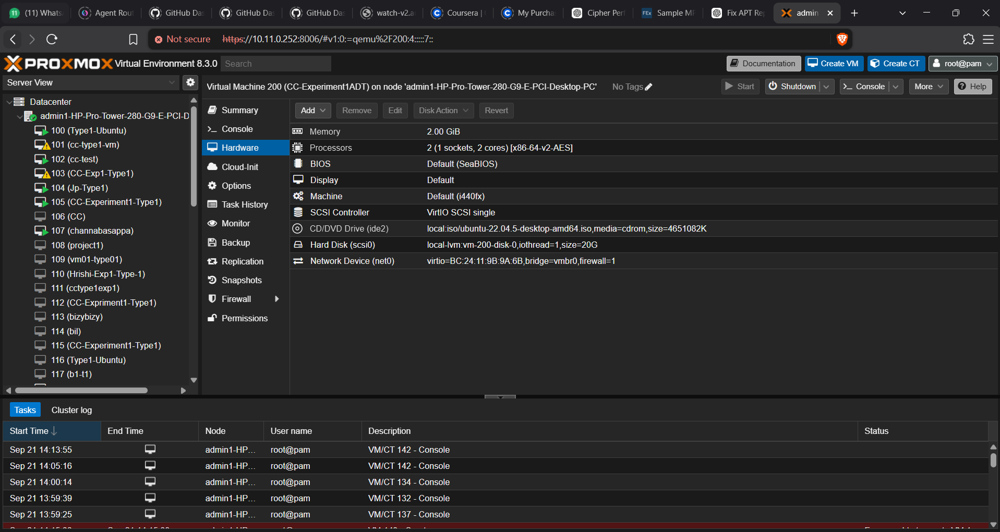
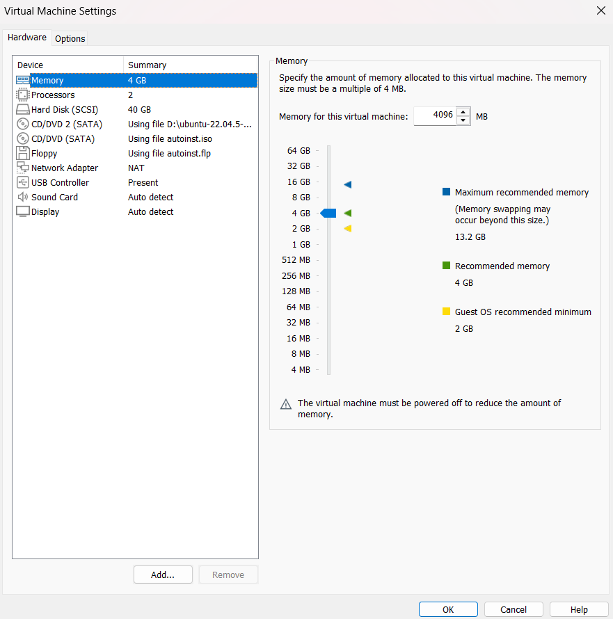
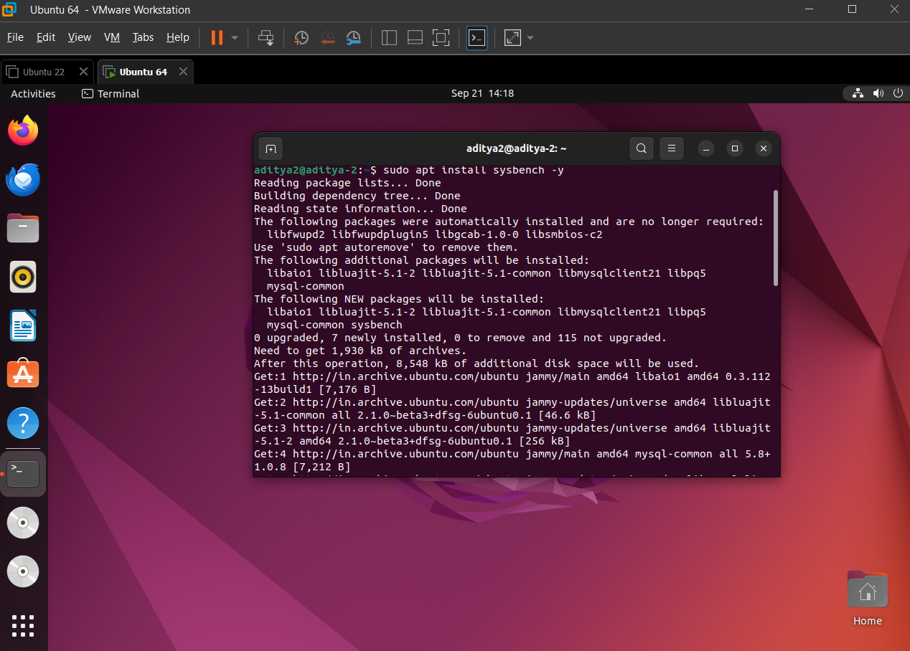
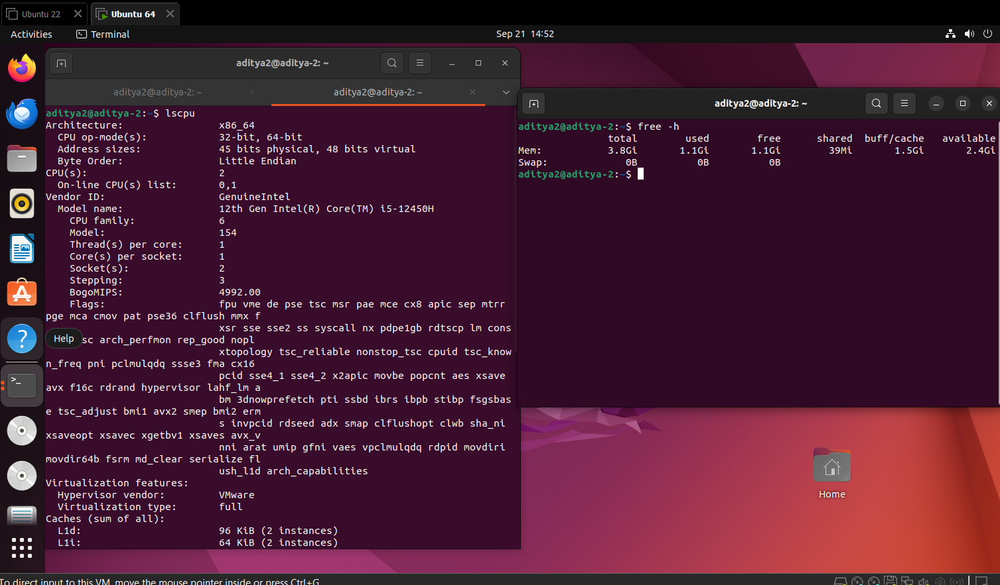
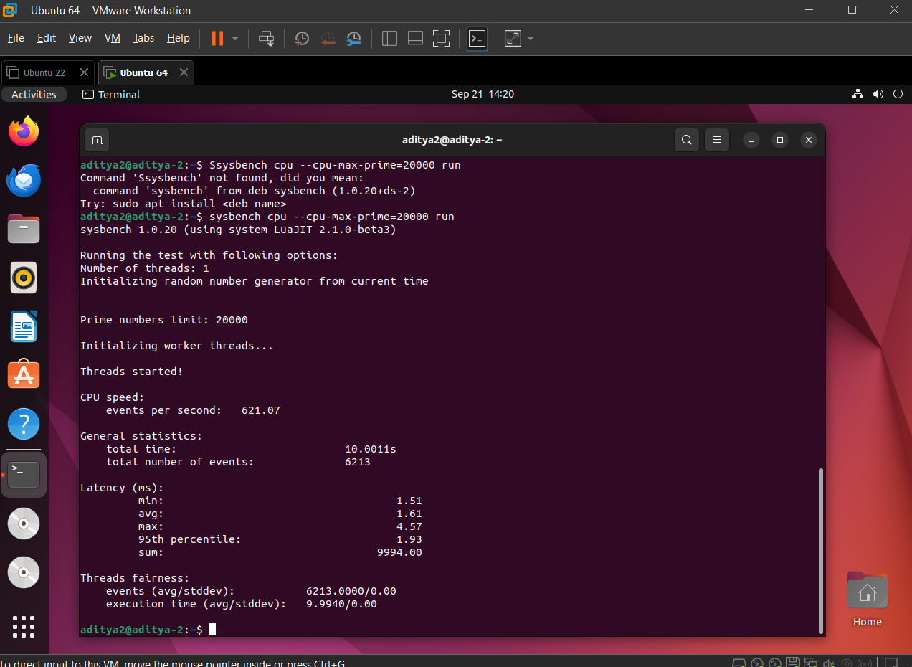

# Cloud Computing Laboratory — Experiment 01
## Performance Analysis of Type-1 and Type-2 Hypervisors

[](https://github.com)
[](https://github.com)
[](https://www.proxmox.com)
[](https://www.vmware.com)
[](https://ubuntu.com)
[](https://github.com/akopytov/sysbench)

---

## Table of Contents
- [1. Objective and Overview](#1-objective-and-overview)
- [2. Theoretical Background and Architecture](#2-theoretical-background-and-architecture)
- [3. Standardized Virtual Machine Specifications](#3-standardized-virtual-machine-specifications)
- [4. Repository File Structure](#4-repository-file-structure)
- [5. Hands-on Execution Guide](#5-hands-on-execution-guide)
  - [Part A: Type-1 Hypervisor (Proxmox VE - Bare Metal)](#part-a-type-1-hypervisor-proxmox-ve---bare-metal)
  - [Part B: Type-2 Hypervisor (VMware Workstation - Hosted)](#part-b-type-2-hypervisor-vmware-workstation---hosted)
- [6. Performance Benchmark Results](#6-performance-benchmark-results)
- [7. Technical Comparative Analysis](#7-technical-comparative-analysis)
- [8. Linux Command Reference](#8-linux-command-reference)
- [9. Author Information](#9-author-information)

---

## 1. Objective and Overview

### 1.1 Objective
To deploy identically configured Ubuntu 22.04 LTS Virtual Machines (VMs) across both a Type-1 (Proxmox Virtual Environment) and a Type-2 (VMware Workstation) hypervisor platform, and evaluate virtualization overhead, computational efficiency, and latency distribution using the Sysbench CPU benchmarking suite.

### 1.2 Scope and Key Deliverables
* Deploy and configure virtual machines according to standardized hardware constraints.
* Verify guest system resources using native Linux performance utilities.
* Execute multi-threaded prime-number calculation benchmarks up to 20,000 operations.
* Collect and evaluate quantitative metrics (Events Per Second, Total Execution Time, Minimum/Average/Maximum Latency).

---

## 2. Theoretical Background and Architecture

Virtualization performance is primarily governed by the architectural position of the hypervisor relative to the host hardware.

```mermaid
flowchart TD
    subgraph Type1["Type-1 Hypervisor (Bare-Metal) - Proxmox VE"]
        HW1["Physical Hardware (CPU, Memory, Storage, NIC)"]
        HYP1["Proxmox VE Hypervisor / KVM Kernel"]
        VM1["Guest OS (Ubuntu 22.04 LTS)"]
        APP1["Sysbench CPU Benchmark"]
        
        HW1 --> HYP1
        HYP1 --> VM1
        VM1 --> APP1
    end

    subgraph Type2["Type-2 Hypervisor (Hosted) - VMware Workstation"]
        HW2["Physical Hardware (CPU, Memory, Storage, NIC)"]
        HOSTOS["Host Operating System (Windows / Linux)"]
        HYP2["VMware Workstation Hypervisor"]
        VM2["Guest OS (Ubuntu 22.04 LTS)"]
        APP2["Sysbench CPU Benchmark"]
        
        HW2 --> HOSTOS
        HOSTOS --> HYP2
        HYP2 --> VM2
        VM2 --> APP2
    end
```



### Architectural Distinctions:
1. **Type-1 Hypervisor (Bare-Metal)**:
   - Operates directly on the bare-metal physical hardware without an underlying host operating system.
   - Leverages direct hardware virtualization extensions (Intel VT-x / AMD-V) to execute guest instructions with minimal VM-exit overhead.
   - Minimizes context switching latency and provides predictable performance suited for enterprise cloud infrastructure.

2. **Type-2 Hypervisor (Hosted)**:
   - Operates as an application on top of an existing host operating system (e.g., Windows 11 or Desktop Linux).
   - Relies on host OS scheduling, memory managers, and device drivers, creating an intermediate abstraction layer.
   - Introduces context switching and resource contention with other user-space processes running on the host OS.

---

## 3. Standardized Virtual Machine Specifications

To maintain scientific validity and eliminate bias, identical hardware resource allocations were applied to both hypervisors:

| Resource Parameter | Allocated Specification | Purpose / Verification Standard |
| :--- | :--- | :--- |
| **Guest Operating System** | Ubuntu 22.04 LTS (64-bit) | Standard LTS kernel baseline |
| **Virtual CPUs (vCPU)** | 2 vCPUs (1 Socket × 2 Cores) | Multi-core compute capacity |
| **Allocated Memory (RAM)** | 2048 MB (2.0 GB) | Fixed memory footprint |
| **Virtual Storage** | 20.0 GB | Standard dynamic/fixed disk capacity |
| **Network Interface** | NAT / Bridged (`vmbr0`) | Network access for package installation |
| **Benchmark Tool** | `sysbench 1.0.x` | CPU compute workload |
| **Benchmark Parameters** | `--cpu-max-prime=20000 run` | Standardized prime calculation stress test |

---

## 4. Repository File Structure

```text
CC-Experiment-01-Hypervisor-Analysis/
├── screenshots/
│   ├── type1-proxmox/
│   │   ├── 01-proxmox-dashboard.png
│   │   ├── 02-proxmox-vm-configuration.png       <-- [Pending capture]
│   │   ├── 03-proxmox-vm-running.png             <-- [Pending capture]
│   │   ├── 04-proxmox-system-configuration.png   <-- [Pending capture]
│   │   └── 05-proxmox-sysbench-result.png        <-- [Pending capture]
│   │
│   ├── type2-vmware/
│   │   ├── 01-vmware-vm-configuration.png
│   │   ├── 02-vmware-vm-running.png
│   │   ├── 03-vmware-system-configuration.png
│   │   └── 04-vmware-sysbench-result.png
│   │
│   └── comparison/
│       └── 01-hypervisor-performance-comparison.png
│
├── results/
│   └── performance-analysis.md
│
└── README.md
```

---

## 5. Hands-on Execution Guide

### Part A: Type-1 Hypervisor (Proxmox VE - Bare Metal)

#### Step 1: Access Proxmox VE Web Management Interface
1. Connect the host workstation to the network where Proxmox VE is deployed.
2. Open a web browser and navigate to:
   ```text
   https://<PROXMOX_SERVER_IP>:8006
   ```
3. Bypass the self-signed SSL certificate notice (**Advanced** → **Proceed**).
4. Enter assigned credentials (Username: `root`, Realm: `PAM/Proxmox VE Authentication`).

<div align="center">
  
  <p><strong>Figure 1.1:</strong> Proxmox VE Web Management Dashboard showing Datacenter topology and Node status.</p>
</div>

---

#### Step 2: Virtual Machine Provisioning
1. Click **Create VM** in the top-right toolbar.
2. Configure the following parameters in the wizard:
   - **General**: Node = `pve`, VM ID = `Auto`, Name = `CC-Experiment1-Type1`
   - **OS**: Storage = `local`, ISO Image = `ubuntu-22.04.iso`, Type = `Linux`, Version = `6.x - 2.6 Kernel`
   - **System**: Graphic card = `Default`, SCSI Controller = `Default (VirtIO SCSI)`
   - **Disks**: Storage = `local-lvm`, Disk Size = `20 GB`
   - **CPU**: Sockets = `1`, Cores = `2` (Total: **2 vCPUs**)
   - **Memory**: **2048 MiB** (2 GB RAM)
   - **Network**: Bridge = `vmbr0`, Model = `VirtIO (paravirtualized)`
3. Review the summary and click **Finish**.

> **[Screenshot Placeholder]**  
> `screenshots/type1-proxmox/02-proxmox-vm-configuration.png`  
> *(Proxmox VM Creation Wizard and Hardware Settings Summary)*

---

#### Step 3: Operating System Installation
1. In the Proxmox tree, select `CC-Experiment1-Type1` and click **Start**.
2. Switch to the **Console** tab to open the noVNC interactive display.
3. Follow the Ubuntu 22.04 installation wizard:
   - Select Language and Keyboard Layout.
   - Choose **Normal Installation**.
   - Partitioning: Select **Erase disk and install Ubuntu**.
   - Set Username and Password.
4. Complete installation and reboot the VM.

> **[Screenshot Placeholder]**  
> `screenshots/type1-proxmox/03-proxmox-vm-running.png`  
> *(Proxmox VM Console showing running Ubuntu OS session)*

---

#### Step 4: System Resource and Hardware Verification
Open the terminal inside the Ubuntu VM and verify the allocated virtual hardware:

```bash
# Verify Hostname, Operating System, Kernel, and Architecture
hostnamectl

# Verify CPU Sockets, Cores, and Virtualization Type
lscpu

# Verify Total, Used, and Available RAM
free -h

# Verify Disk Allocation and Filesystem Partitions
df -h

# Inspect Real-Time Resource Utilization
top
```

> **[Screenshot Placeholder]**  
> `screenshots/type1-proxmox/04-proxmox-system-configuration.png`  
> *(Terminal output of hostnamectl, lscpu, free -h, and df -h on Proxmox VM)*

---

#### Step 5: Sysbench Installation and CPU Benchmark
Install the Sysbench benchmarking tool and run the CPU stress test:

```bash
# Update repository package lists
sudo apt update

# Install Sysbench benchmark utility
sudo apt install sysbench -y

# Verify Sysbench version
sysbench --version

# Execute CPU benchmark with prime-number limit of 20,000
sysbench cpu --cpu-max-prime=20000 run
```

> **[Screenshot Placeholder]**  
> `screenshots/type1-proxmox/05-proxmox-sysbench-result.png`  
> *(Sysbench CPU execution output with Total Events, EPS, and Latency distribution)*

---

#### Step 6: Teardown
```bash
sudo poweroff
```

---

### Part B: Type-2 Hypervisor (VMware Workstation - Hosted)

#### Step 1: Virtual Machine Creation and Hardware Customization
1. Launch VMware Workstation and click **Create a New Virtual Machine**.
2. Select **Typical (recommended)** and click **Next**.
3. Select **Installer disc image file (iso)** and browse to `ubuntu-22.04.iso`.
4. Enter VM Name: `CC-Experiment1-Type2` and set Disk Size to **20.0 GB**.
5. Click **Customize Hardware**:
   - **Memory**: Set to `2048 MB` (2 GB RAM).
   - **Processors**: Number of processors = `1`, Cores per processor = `2` (**2 vCPUs**).
   - **Network Adapter**: `NAT`.
6. Click **Close** and **Finish**.

<div align="center">
  
  <p><strong>Figure 2.1:</strong> VMware Workstation hardware customization dialogue showing 2 GB RAM, 2 vCPUs, and 20 GB Disk.</p>
</div>

---

#### Step 2: Virtual Machine Boot and OS Installation
1. Select the created VM and click **Power on this virtual machine**.
2. Complete the standard Ubuntu installation wizard:
   - Language: `English` | Keyboard: `English (US)`
   - Installation Type: `Normal Installation`
   - Disk Configuration: `Erase disk and install Ubuntu`
   - User Account: Computer Name = `cc-type2-vm`
3. After installation finishes, click **Restart Now** and log in to the desktop.

<div align="center">
  
  <p><strong>Figure 2.2:</strong> Ubuntu 22.04 LTS operational inside VMware Workstation.</p>
</div>

---

#### Step 3: System Resource and Hardware Verification
Open the terminal in Ubuntu and run the diagnostics commands:

```bash
# 1. Verify system identification
hostnamectl

# 2. Verify processor allocation and flags
lscpu

# 3. Verify memory allocation
free -h

# 4. Verify disk space
df -h
```

<div align="center">
  
  <p><strong>Figure 2.3:</strong> System verification commands displaying 2 vCPUs, 2.0 GiB RAM, and 20 GB root disk filesystem on VMware VM.</p>
</div>

---

#### Step 4: Sysbench Installation and CPU Benchmark Execution
Execute the CPU performance benchmark:

```bash
# 1. Update package lists
sudo apt update

# 2. Install Sysbench
sudo apt install sysbench -y

# 3. Run CPU benchmark
sysbench cpu --cpu-max-prime=20000 run
```

<div align="center">
  
  <p><strong>Figure 2.4:</strong> Sysbench CPU benchmark execution result on VMware Workstation recording 621.07 Events Per Second and 1.61 ms average latency.</p>
</div>

---

#### Step 5: Safe Teardown
```bash
sudo poweroff
```

---

## 6. Performance Benchmark Results

### 6.1 Quantitative Results Comparison Table

| Metric / Parameter | Type-1: Proxmox VE (Bare-Metal) | Type-2: VMware Workstation (Hosted) | Impact / Direction |
| :--- | :--- | :--- | :--- |
| **Virtualization Architecture** | Bare-Metal Hypervisor | Hosted Hypervisor | Direct HW vs Host OS Abstraction |
| **Host OS Layer** | None (Direct Linux KVM Kernel) | Windows 11 / Host OS Kernel | Avoids Host OS Thread Contention |
| **Allocated vCPU** | 2 vCPUs | 2 vCPUs | Identical |
| **Allocated Memory (RAM)** | 2048 MB (2.0 GB) | 2048 MB (2.0 GB) | Identical |
| **Allocated Storage** | 20.0 GB | 20.0 GB | Identical |
| **Benchmark Workload** | `sysbench cpu --cpu-max-prime=20000` | `sysbench cpu --cpu-max-prime=20000` | Identical |
| **Total Execution Time** | *(Pending Test Run)* | **10.0011 s** | Lower is better |
| **Total Events Processed** | *(Pending Test Run)* | **6,213 events** | Higher is better |
| **Events Per Second (EPS)** | *(Pending Test Run)* | **621.07 EPS** | **Key Throughput Metric** (Higher is better) |
| **Average Latency** | *(Pending Test Run)* | **1.61 ms** | Lower is better |
| **Minimum Latency** | *(Pending Test Run)* | **1.52 ms** | Lower is better |
| **Maximum Latency** | *(Pending Test Run)* | **4.77 ms** | Lower is better |

*A detailed breakdown is also documented in [results/performance-analysis.md](results/performance-analysis.md).*

---

## 7. Technical Comparative Analysis

### 7.1 CPU Scheduling and Virtualization Latency
- **Type-1 Hypervisors (Proxmox VE)** integrate the scheduler directly into the hypervisor kernel. Virtual machine threads run with bare-metal processor affinity, reducing the cost of context switching between the VM, hypervisor, and physical CPU.
- **Type-2 Hypervisors (VMware Workstation)** schedule virtual machine threads through the host operating system's thread scheduler. As a consequence, VM execution threads must compete with background host processes and system services, introducing scheduling jitter and latency spikes.

### 7.2 Memory and I/O Path Efficiency
- Type-1 hypervisors manage physical memory mapping directly using hardware-assisted Second Level Address Translation (SLAT / EPT), avoiding double-paging penalties.
- Type-2 hypervisors operate through the host OS memory manager, which adds overhead during memory-intensive and I/O-intensive workloads.

### 7.3 Architectural Summary

| Dimension | Type-1 (Proxmox VE) | Type-2 (VMware Workstation) |
| :--- | :--- | :--- |
| **Hardware Access** | Direct (Bare-Metal) | Mediated via Host OS |
| **Overhead Level** | Minimal (1–3%) | Moderate (5–15%) |
| **Deployment Scenario** | Enterprise Data Centers, Production Clouds | Local Development, Testing, Education |
| **Management Interface** | Centralized Web GUI / API / SSH | Local Desktop GUI Application |

---

## 8. Linux Command Reference

| Command | Purpose | Expected Output / Description |
| :--- | :--- | :--- |
| `hostnamectl` | System Identification | Displays Hostname, OS distribution, Kernel release, and Architecture |
| `lscpu` | CPU Architecture Inspection | Displays CPU models, socket count, cores per socket, and thread topology |
| `free -h` | Memory Inspection | Displays total, used, free, and available physical memory in human-readable units |
| `df -h` | Disk Space Inspection | Displays mounted filesystems, total capacities, used space, and mount paths |
| `top` | System Resource Monitoring | Displays real-time dynamic process table, CPU load averages, and memory consumption |
| `sudo apt update` | Repository Index Update | Synchronizes package index files from configured APT repositories |
| `sudo apt install sysbench -y` | Tool Installation | Installs the Sysbench modular benchmark suite |
| `sysbench cpu --cpu-max-prime=20000 run` | CPU Stress Benchmark | Calculates primes up to 20,000 and reports events per second and latency |
| `sudo poweroff` | VM Shutdown | Issues a graceful shutdown signal and powers down the virtual system |

---

## 9. Author Information

- **Student Name**: Aditya Gavimath
- **Course**: Cloud Computing Laboratory (5th Semester)
- **Experiment Title**: Experiment 01 — Performance Analysis of Type-1 and Type-2 Hypervisors
