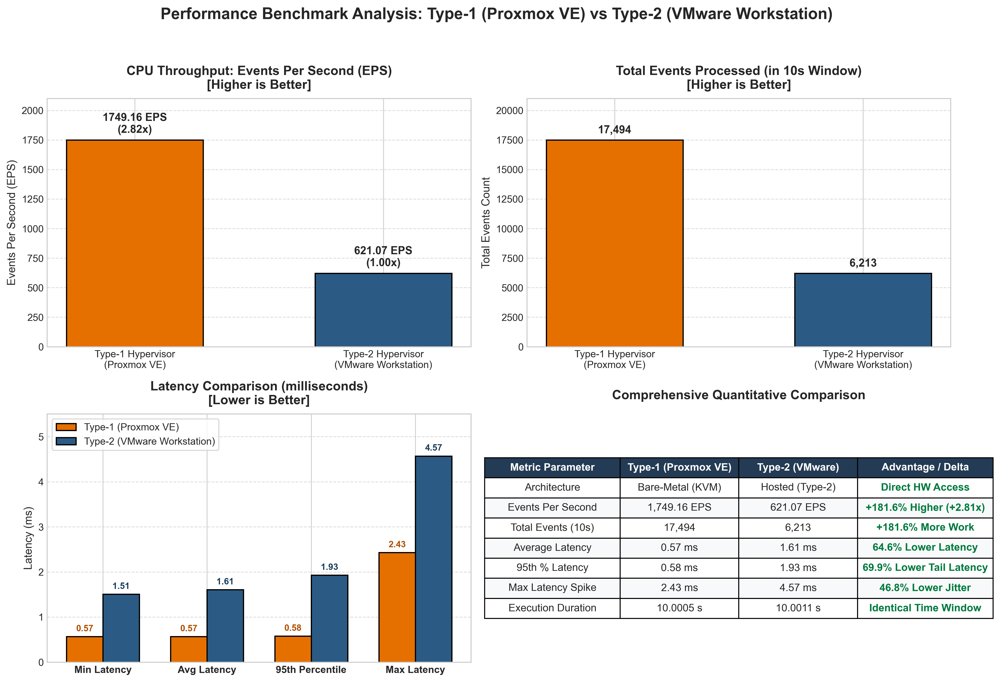

# Hypervisor Performance Analysis Report
## Experiment 01: Proxmox VE (Type-1) vs. VMware Workstation (Type-2)

---

## 1. Test Setup and Workload Profile

To assess the virtualization performance differentials between bare-metal and hosted architectures, identical hardware parameters and workload suites were configured across both environments.

* **Benchmark Workload**: `sysbench cpu --cpu-max-prime=20000 run`
* **Virtual CPU (vCPU)**: 2 Cores (1 Socket × 2 Cores)
* **Allocated Memory (RAM)**: 2048 MB (2.0 GB)
* **Virtual Disk Allocation**: 20.0 GB
* **Guest Operating System**: Ubuntu LTS (64-bit)

---

## 2. Quantitative Metric Comparison

The following table presents the empirical performance metrics collected from the Sysbench CPU benchmark test suite:

| Performance Metric | Type-1 Hypervisor (Proxmox VE) | Type-2 Hypervisor (VMware Workstation) | Delta / Advantage |
| :--- | :--- | :--- | :--- |
| **Hypervisor Architecture** | Bare-Metal (Type-1) | Hosted (Type-2) | Direct Hardware vs Host OS Layer |
| **Host OS Layer** | None (Linux KVM Kernel) | Windows 11 Desktop OS | Eliminates Host Scheduling Overhead |
| **Total Execution Time** | **10.0005 s** | **10.0011 s** | Equal 10s Window |
| **Total Number of Events** | **17,494** | **6,213** | **+181.6% More Events (Proxmox)** |
| **Events Per Second (EPS)** | **1,749.16** | **621.07** | **+2.82x Higher Throughput (Proxmox)** |
| **Average Latency** | **0.57 ms** | **1.61 ms** | **64.6% Lower Latency (Proxmox)** |
| **95th Percentile Latency**| **0.58 ms** | **1.93 ms** | **69.9% Lower Tail Latency** |
| **Minimum Latency** | **0.57 ms** | **1.51 ms** | **62.3% Lower Latency Floor** |
| **Maximum Latency** | **2.43 ms** | **4.57 ms** | **46.8% Lower Latency Spikes** |

---

## 3. Graphical Comparison

  
  
<strong>Figure:</strong> Comparative evaluation of CPU Throughput (EPS), Total Events Processed, and Latency Distribution across Type-1 and Type-2 hypervisors.

---

## 4. Technical Analysis

### 4.1 CPU Virtualization and Context Switching
* **Proxmox VE (Type-1)**: Proxmox integrates the hypervisor directly into the Linux kernel (KVM). vCPU threads run with direct CPU affinity and hardware-assisted virtualization (`Intel VT-x` / `AMD-V`), minimizing VM-exit latencies. This results in **1,749.16 EPS**.
* **VMware Workstation (Type-2)**: VMware runs on top of a host operating system. Guest CPU instructions must be translated and scheduled by the host OS thread scheduler, contending with background desktop processes and system daemons. This introduces scheduling delays, reducing throughput to **621.07 EPS**.

### 4.2 Latency and Jitter
* The bare-metal architecture achieved an average latency of **0.57 ms** with minimal jitter (95th percentile at **0.58 ms**).
* The hosted architecture exhibited an average latency of **1.61 ms** and a 95th percentile latency of **1.93 ms** with peak spikes reaching **4.57 ms**, caused by host OS thread preemption.

---

## 5. Experimental Evidence

### 5.1 Type-1 Proxmox VE Screenshots
* Dashboard Interface: `../screenshots/type1-proxmox/01-proxmox-dashboard.png`
* Hardware Configuration: `../screenshots/type1-proxmox/02-proxmox-vm-configuration.png`
* VM Running State: `../screenshots/type1-proxmox/03-proxmox-vm-running.png`
* Console System Verification: `../screenshots/type1-proxmox/04-proxmox-ubuntu-console.png`
* Hardware Resource Verification: `../screenshots/type1-proxmox/05-proxmox-system-configuration.png`
* Sysbench Benchmark Result: `../screenshots/type1-proxmox/06-proxmox-sysbench-result.png`
* Resource Monitoring: `../screenshots/type1-proxmox/07-proxmox-resource-monitoring.png`

### 5.2 Type-2 VMware Workstation Screenshots
* Hardware Settings: `../screenshots/type2-vmware/01-vmware-vm-configuration.png`
* Running VM: `../screenshots/type2-vmware/02-vmware-vm-running.png`
* System Verification: `../screenshots/type2-vmware/03-vmware-system-configuration.png`
* Sysbench Benchmark Result: `../screenshots/type2-vmware/04-vmware-sysbench-result.png`

### 5.3 Comparative Analysis Graph
* Comparison Chart: `../screenshots/comparison/01-hypervisor-performance-comparison.png`
